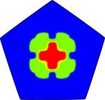
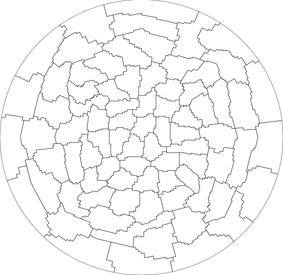

# polyDEAL (Polytopal Discontinuous Galerkin in deal.II)

[](https://github.com/fdrmrc/Polydeal/actions/workflows/tests.yml)
[](https://github.com/fdrmrc/Polydeal/actions/workflows/indentation.yml)
[](https://github.com/fdrmrc/Polydeal/actions/workflows/doxygen.yml)

[](https://zenodo.org/doi/10.5281/zenodo.11065519)


***PolyDEAL*** is an open source library which aims to provide building blocks for the developement of Polytopal Discontinuous Galerkin methods, using the Finite Element library [**deal.II**](https://dealii.org) in 2D and 3D. It is written in C++ using the C++17 standard. The parallel implementation builds on top of the Message Passing Interface (MPI) communication model.


## Getting started and prerequisites

We require:
- **cmake** version greater than 2.8.
- One of the following compilers:
    -  **gcc** version  >= 9.4.0
    -  **clang** version >= 15
    -  **icc** (Intel compiler) 2021.2
- **openMPI** version  >= 4.0.3
- **deal.II** version >= 9.6

The library **polyDEAL** employs **deal.II** as main third-party library. As **deal.II** itself depends on other external libraries for many functionalities, we strongly suggest to download and install deal.II following the instructions available at https://www.dealii.org/download.html and https://www.dealii.org/developer/readme.html. The minimal set of other external libraries that we require are: **METIS**, **p4est**, **Trilinos**. All of them should be compiled against  MPI during the installation phase of deal.II. 

While *METIS* is generally used to partition a triangulation among several processors, in the context of polytopal methods it is heavily employed as an agglomeration strategy to build polytopic elements out of fine grids composed by standard shapes. *Trilinos* (in particular its multilevel solvers and distributed matrices) is employed as main parallel linear algebra library. We also support novel agglomeration strategies based on the R-tree spatial data structure.


To enable to computation of some quality metrics, mostly of theoretical interests and not really relevant in application codes, the external library **CGAL** is required. As this is a dependency of *deal.II* as well, it is sufficient to configure deal.II with it.

We currently support the following features:
* Unified interface for 2D and 3D problems.
* Distributed-memory implementation through MPI.
* Parallel agglomerated multigrid support.
* Discontinuous Galerkin spaces of order $p$.
* Different agglomeration strategies.


Part of the algorithms have been described in the following publication: [*R3MG: R-tree based agglomeration of polytopal grids with applications to multilevel methods.*](https://www.sciencedirect.com/science/article/abs/pii/S0021999125000567)
```
@article{FEDER2025113773,
title = {R3MG: R-tree based agglomeration of polytopal grids with applications to multilevel methods},
journal = {Journal of Computational Physics},
volume = {526},
pages = {113773},
year = {2025},
issn = {0021-9991},
doi = {https://doi.org/10.1016/j.jcp.2025.113773},
url = {https://www.sciencedirect.com/science/article/pii/S0021999125000567},
author = {Marco Feder and Andrea Cangiani and Luca Heltai},
keywords = {Polytopal grids, Agglomeration, Discontinuous Galerkin, Multilevel methods, Spatial data structures}
}
```

## Building polyDEAL 
Assuming deal.II is installed on your machine and meets the requirements above, all is required to do is:

```bash
git clone git@github.com:fdrmrc/Polydeal.git
cd Polydeal/
mkdir build
cd build/
cmake -DDEAL_II_DIR=/path/to/deal.II ..
make -j<N>
```
being ```N``` is the number of jobs you want to use to compile.


## About grids and post-processing
Polygonal or polyhedral grids are generated through agglomeration. To give an easy example in 2D, here's a polygonal grid associated to the unit ball on which you can define a Discontinous Galerkin space. The 3D case is completely analougous.

[]()

The (discontinuous) Finite Element space is defined on the bounding box of each agglomerate. In order to visualize the solution, carry out convergence tests, and other post-processing issues, the solution computed on the polytopal grid is interpolated onto the underlying fine mesh composed of classical quadrilaterals or hexahedra. 

## Examples
Some example applications are shown in the ```examples/``` directory. To build and run one of the examples, say ```diffusion_reaction.cc```, it is sufficient the following:
```bash
// assume you have a build generated as above
cd build/examples
make
mpirun -np<N> ./diffusion_reaction
```
where ```N``` is the number of processors you want to use.


## Documentation
A Doxygen generated documentation is built and deployed at each merge to the main branch. You can find the latest documentation here: [https://fdrmrc.github.io/Polydeal/](https://fdrmrc.github.io/Polydeal/).

## Authors and Contact

This project is developed and maintained by:
- [Marco Feder](https://www.math.sissa.it/users/marco-feder) ([@fdrmrc](https://github.com/fdrmrc)), SISSA, IT

under the supervision of 
- [Prof. Andrea Cangiani](https://people.sissa.it/~acangian/) ([@andreacangiani](https://github.com/andreacangiani)), SISSA, IT
- [ Prof. Luca Heltai](https://sites.google.com/view/luca-heltai) ([@luca-heltai](https://github.com/luca-heltai)), University of Pisa, IT


Feel free to start a [discussion](https://github.com/fdrmrc/Polydeal/discussions) or open an [issue](https://github.com/fdrmrc/Polydeal/issues), especially if you want to contribute. For any other inquiries or special requests, you can directly contact mfeder@sissa.it.